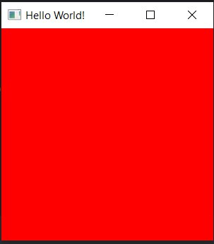

# Курсовая работа

## Редактор частиц на OpenGL

Зейденс Никита Вячеславович ПО-9

## Ход работы

Файлы проекта с кодом:

- [main](./src/HelloWorld.java)

## Объяснения:

- ### Система координат OpenGL
  > В OpenGL координатная сетка представлена следующим образом:  

  > В центре экрана располагается точка с координатами (0, 0, 0).  

  > Далее координата x вправо изменяется до 1, влево до -1  

  > Далее координата y вверх изменяется до 1, вниз до -1  
  
  > Далее координата z к наблюдателю изменяется до 1, от наблюдателя до -1  

- ### Вершины
  > Вершины - набор данных из координат, где она располагается, её цвет, нормали (для освещения, но я не использую) и текстуры  

- ### Полигон
  > Полигон - наименьшый объект представления модели в 3д пространстве, из которого можно изобразить любую другую фигуру.

  > В данном случае, чтобы отобразить полигон, нужно указывать его вершины против часовой стрелки.  

  > Например, квадрат - 2 полигона, для которых вершины указываются против часовой стрелки.

  > Поэтому указываем левую верхнюю, левую нижнюю, правую верхнюю. После правую верхнюю, левую нижнюю, правую нижнюю.

- ### VAO
  > Vertex Array Object, хранит атрибуты 3д модели, содержит множество слотов - атрибутов, может хранить до 16 таких.  
  
  > Для обращения к данному объекту мы используем специальный ID, который возвращается при его создании.  
  
  > Например, один атрибту хранит позиции вершин, другой цвета вершин, третий нормали вершин, четвёртый координаты текстур вершин.  
  
  > Данные атрибуты хранятся в качестве VBO

- ### VBO
  > Vertex Buffer Object - массив данных, который представлен вещественными числами, описывабщими тот или иной атрибут

- ### Index Buffer (индекс вершин) 
  > При использовании только VBO мы храним данную вершину столько раз, сколько полигонов её содержат, что не очень выгодно в плане ресурсов.  

  > Таким образом мы не экономим память, в любом из случаев, даже когда полигонов мало, либо они содержат мало информации.  
  
  > А теперь представим, что вершина хранит 16 атрибутов и повторяется около сотни раз, при таком случае никаких ресурсов не хватит на её хранение.  

  > Для этого придумана индексация вершин, мы единожды записываем все нужные нам вершины в буфер, далее, при помощи индексов, отрисовываем данные вершины.
  
  > И теперь, вместо хранения множества повторяющихся вершин, мы храним лишь список индексов вершин, которые нужно нарисовать, первая оптимизация!

- ### Shader (шейдер)
  > Шейдер - маленькая программа, которая выполняется на GPU. Всего существует 3 типа шейдеров:
  > 1. Вершинный шейдер - шейдер, который отвечает за то, где будут располагаться вершины модели.
  > 2. Геометрический шейдер - шейдер, который определяет, каким образом будет выглядеть объект.
  > 3. Фрагментарный шейдер - шейдер, который определяет то, как будет разукрашен объект.
  
  > У каждого шейдера есть входные и выходные данные, также есть унифромы.  
  
  > В то время, как входные и выходные данные доступны лишь внутри шейдера, униформы могут быть использованы любым шейдером.  
  
  > Таким образом можно изменять каждый объект так, как это нужно нам без переинициализации атрибутов VAO.

- ### Текстура
  > В нашем случае текстурой выступает картинка с расширением .png.  
  
  > Для того, чтобы добавить текстуру к 3д модели нужно указать, какие вершину в какой части текстуры располагаются.  
  
  > Система координат в данном случае снова другая, которая определяется так:
  > верхний левый угол изображение - (u, v) - (0, 0), вправо u меняется до 1, вниз v меняется до 1.
  
  > Таким образом выбирается нужная часть изображения для полигона.
  
  > Данные вновь группируются по вершинам и через VAO отправляются в шейдер, где и отрисовываются.

- ### Сцена
  > То, как располагаются объекты в пространстве, освещение, камера и другие.

- ### Матрица трансформации
  > В OpenGL выделяют 3 вида трансформации 3д модели:
  > 1. Трансляция, также известная, как перемещение объекта. Состоит из xyz координат, расположенных матрицей 3x1.
  > 2. Вращение. Состоит из Rx, Ry, Rz координат, расположенных матрицей 1x3.
  > 3. Размер. Описывается параметром S. Представляет собой единственное значение.

  > Но для хранения всех трёх трансформаций используется лишь одна матрица 4x4.

- ### Матрица проекции
  > В OpenGL для того, чтобы видеть в 3д, как мы это делаем в реальной жизни, есть условная проекция с 3 параметрами:
  > 1. Поле зрения камеры - градус обзора, который определяет, насколько много пространства в ширину можно увидеть.
  > 2. Ближайшая видимая плоскость - расстояние от камеры до точки, от которой начинается отображение сцены.
  > 3. Дальняя видимая плоскость - расстояние от камеры до точки, от которой заканчивается отображение сцены.
  
  > Данная матрица, как и матрица трансформации, представляет собой матрицу 4x4.

- ### Камера (не путать с матрицей проекции)
  > Сущность, которая имеет позицию в пространстве, pitch - поворот налево или направо, yaw - высота, roll - поворот.
  
  > Благодаря данной сущности можно осматривать сцену или создавать визуальные эффекты (тени, отражения и другие).

- ### Частицы (то, ради чего мы собрались)
  > Частица - сущность в пространстве, имеющая в нашем случае направление движения, скорость, время жизни, размер, позицию, гравитацию, поворот.

  > В некоторой области пространства с заданными условиями появляются, проживают отведённое время и уничтожаются частицы.

  > Таким образом можно создавать множество различных визуальных эффектов, а в данном случае лишь некоторые из них. 

### Текущий результат работы - базовая инициализация окна для отрисовки

Примерный ожидаемый результат работы:

Пример docx

[pdf](./res/lab3_SPP.pdf)

Пример docx

[docx](./res/Теория%20Информации.docx)

